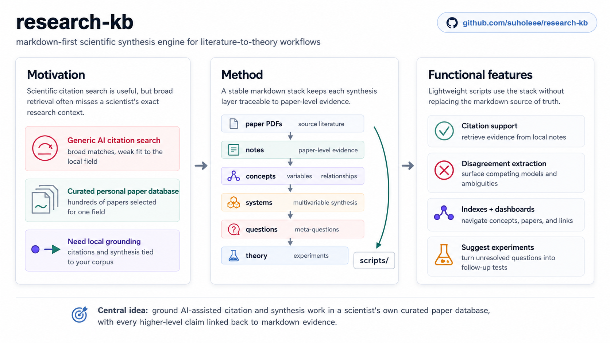

# research-kb: a markdown-first knowledge base for scientific synthesis

This repository shows the methodology and architecture behind a markdown-first research knowledge base used to synthesize across roughly 200 papers in chromatin and membrane biophysics. The public release includes the core conventions, tooling, and a small representative content sample. The full private corpus, including the complete paper-note library and working synthesis pages, is intentionally not included here.

*Figure: `research-kb` grounds citation support and synthesis in a scientist's curated paper corpus, then promotes PDFs through markdown layers into questions, theory, and suggested experiments.*

## Architecture

The KB is organized as a layered markdown system:

- `notes/` stores paper-level notes and is the main evidence layer.
- `concepts/`, `variables/`, and `relationships/` normalize recurring entities, observables, and supported links across papers.
- `systems/` captures compact multivariable syntheses.
- `questions/` and `meta_questions/` express single-system and cross-system research questions.
- `theory/` and `experiments/` turn the synthesis stack into output-oriented abstractions and follow-up tests.

In the original private KB, these layers sit upstream of generated navigation and reporting layers such as `indexes/`, `dashboards/`, and `outputs/`. Those derived layers are omitted here to keep the public release focused on the source methodology.

## Conventions

The core methodology is documented in [KB_CONVENTIONS.md](./KB_CONVENTIONS.md). That file defines the layer responsibilities, note schema, filename conventions, evidence-handling rules, and expected structure for cross-paper synthesis pages.

## Tooling

The `scripts/` directory contains the Python utilities used to maintain and analyze the KB. The most directly reusable script in this public release is `scripts/extract_disagreements.py`, which scans `questions/`, `meta_questions/`, `systems/`, `concepts/`, and `variables/` for disagreement-structured sections and extracts them into machine-readable outputs in the full private workflow.

Other scripts cover note validation, corpus statistics, index generation, paper-note population, extraction support, and local update workflows. They are included here to show how the markdown-first structure supports lightweight automation without requiring a database or web app.

## Sample Content

The `examples/` directory contains a curated sample from each major layer:

- `examples/notes/` shows paper-level evidence records.
- `examples/concepts/` shows cross-paper concept synthesis.
- `examples/variables/` shows normalization of recurring observables.
- `examples/relationships/` shows supported variable-to-variable links.
- `examples/systems/` shows compact multivariable synthesis pages.
- `examples/questions/` shows richer research-question pages built on the synthesis layers.
- `examples/meta_questions/` shows a cross-system synthesis question.
- `examples/theory/` shows one grounded abstraction page.
- `examples/experiments/` shows one output-oriented experiment-design page.

The sample is intentionally partial. Some example pages link to notes or related pages that are part of the private corpus and are not included in this public release.

## Features

- **Citation assistant**: `scripts/suggest_citations_claude.py` and `scripts/suggest_citations_codex.py` take a draft paragraph from `paragraphs/`, retrieve relevant evidence from the local KB, and generate a citation-suggestion report under `outputs/citation_suggestions/`. The workflow is designed to keep citation support grounded in existing notes, concepts, and other markdown layers rather than relying on external search.
- **Disagreement extractor**: `scripts/extract_disagreements.py` scans populated disagreement-shaped sections across synthesis layers such as `meta_questions/`, `questions/`, `systems/`, `concepts/`, and `variables/`. It writes structured disagreement questions to `outputs/disagreement_questions.yaml` and a coverage report to `outputs/disagreement_extraction_report.md`, making unresolved conflicts easier to audit and reuse.

## How To Use This For Your Own KB

Start with `notes/` and make paper-level structure stable before trying to automate anything. Once a note layer is consistent, build `concepts/` and `variables/` to normalize recurring ideas and observables. Use `relationships/` and `systems/` to compress repeated cross-paper structure into reusable synthesis. Only after that should you promote recurring tensions into `questions/`, then into `meta_questions/`, `theory/`, and `experiments/`.

The intended workflow is incremental: keep markdown files as the source of truth, prefer explicit conventions over hidden application logic, and let scripts operate on stable file structure rather than on a bespoke backend.

## Limitations

This is a working KB methodology, not a finished product. The conventions continue to evolve as the corpus grows, and the markdown-first format is intentionally opinionated. It favors transparency, grep-ability, and scriptability over richer app-layer features such as structured databases, collaborative UI, or ontology enforcement.

## License

This repository is released under the MIT License. See [LICENSE](./LICENSE).
